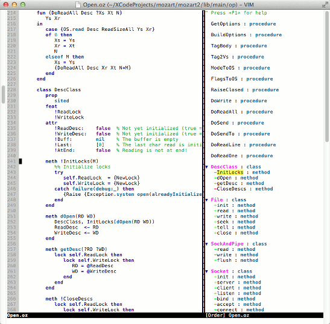

oztags
======

**oztags** is a program to create `tags` file for Oz 3.x source files. The generated file is designed to be used with Vim [Tagbar](http://majutsushi.github.io/tagbar/) only.

Prerequisite
------------

* Python 3.x
* Vim 7.3 or above
* Vim Tagbar 5.8 or above

Installation
------------

1. Run `make`.
2. Copy `plugin/tagbar-oz.vim` into `~/.vim/plugin`.
3. Copy `oztags` to an executable path.

TODO
----

* Change the implementation from Python to Oz.
* Display signature of procedure and methods.
